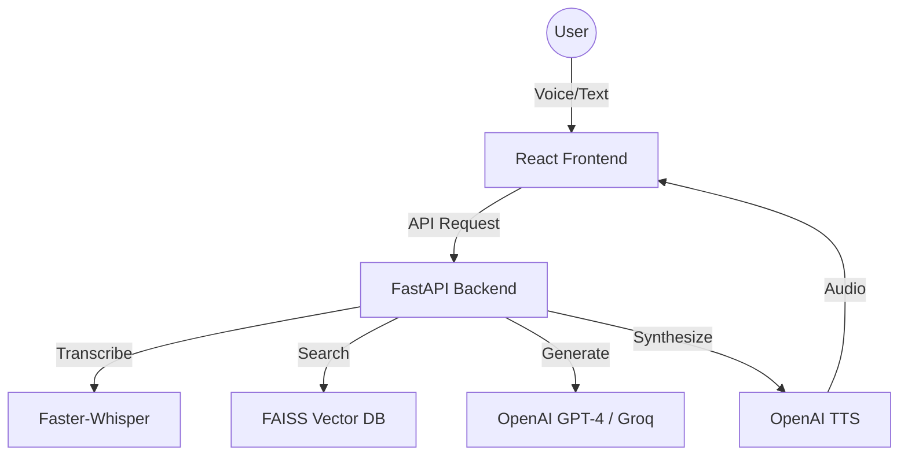

# 🎓 EchoLearn AI: The Universal Voice Tutor

[](https://www.python.org/)
[](https://fastapi.tiangolo.com/)
[](https://reactjs.org/)
[](https://opensource.org/licenses/MIT)

**EchoLearn AI** is a cutting-edge voice tutor system powered by RAG (Retrieval-Augmented Generation). Upload your learning materials (PDFs or Jupyter Notebooks) and have human-like, voice-driven conversations with an AI tutor that knows your content inside and out.

---

## 🌟 Key Features

- **🎙️ Voice-First Interaction**: Conversational learning with local Speech-to-Text (Whisper) and realistic Text-to-Speech (OpenAI).
- **📚 Smart Document Parsing**: Specialized loaders for PDFs and Jupyter Notebooks (retaining code and structure).
- **🧠 Context-Aware Brain**: Retrieval pipeline ensures the tutor stays grounded in your specific documents.
- **✨ Modern UI**: A premium React dashboard with smooth animations and interactive voice controls.
- **🤖 Hands-Free Mode**: Engage in continuous conversation without clicking buttons.
- **💾 Local Vector DB**: Uses FAISS for lightning-fast local search without external cloud databases.

---

## 🏗️ System Architecture



---

## 📂 Project Structure

```text
EchoLearner-AI/
├── backend/            # FastAPI Source Code
│   ├── server.py       # Main Entry Point
│   ├── tutor_agent.py  # RAG Logic
│   └── ...modules      # Processing & Loading Logic
├── frontend/           # React + Vite Application
├── bin/                # Legacy codes & redundant scripts
├── data/               # Vector index, uploads, and audio
├── .env                # Project Configuration
└── README.md           # This file
```

---

## 🚀 Quick Start

### 1. Requirements
- Python 3.9+
- Node.js & npm

### 2. Installation

**Backend:**
```bash
# Navigate to backend
cd backend
# Install dependencies
pip install -r requirements.txt
```

**Frontend:**
```bash
# Navigate to frontend
cd frontend
# Install dependencies
npm install
```

### 3. Configuration
Create a `.env` file in the root directory (use the template provided) and add your API keys:
```env
OPENAI_API_KEY=your_key_here
```

### 4. Running the App

**Start Backend:**
```bash
python backend/server.py
```

**Start Frontend:**
```bash
cd frontend
npm run dev
```
Visit `http://localhost:3000` to start learning!

---

## 🧪 Technologies

- **Backend**: FastAPI, LangChain, FAISS, Faster-Whisper, PyMuPDF
- **Frontend**: React, Vite, Framer Motion, Lucide Icons
- **AI**: OpenAI GPT-4, OpenAI TTS, SentenceTransformers

---

## 🤝 Contributing
Feel free to fork this project and submit PRs. For major changes, please open an issue first.

---
**Made with ❤️ for the future of learning.**
